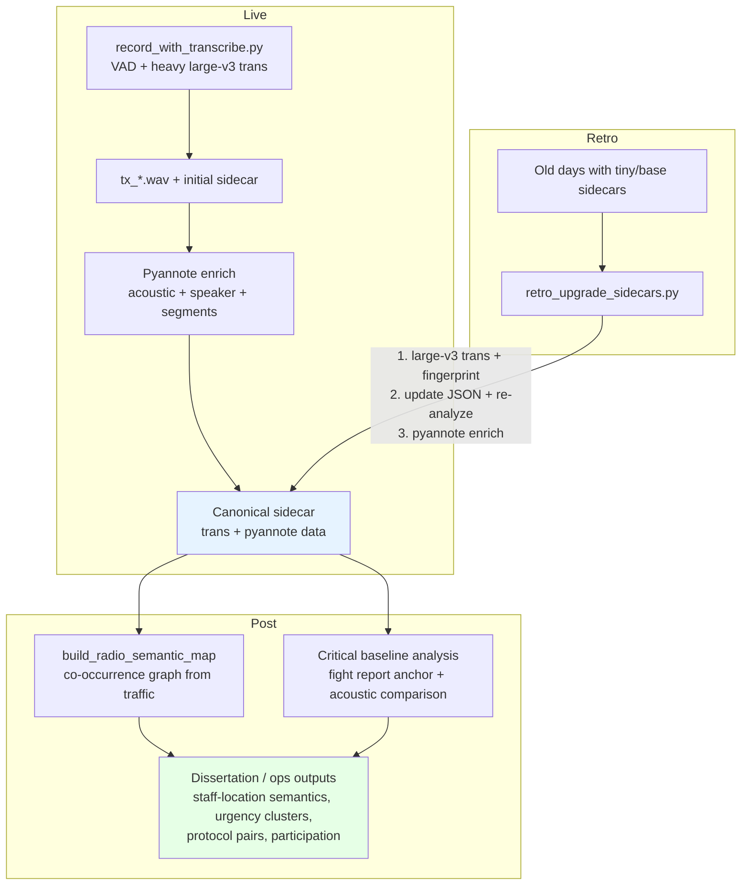

# EduPulse

EduPulse captures school administrative radio traffic
(Cobra PX650 + UCA222) and turns it into structured data:
one short raw `.wav` per transmission + sidecar metadata
(real-time transcription, category, INC-xxx incident ID,
students, roles).

**Current state (June 2026):** Full data collection for the
school year is complete. We have multiple days of
per-transmission audio + metadata. The focus has shifted
to offline iteration during the 3-month break:
re-transcribe marginal segments with heavier models,
refine rules using real transcripts, and produce usable
metrics.

The most important outputs are the raw `.wav` files
(high-fidelity, untouched) and the retagged manifests.

## Essential Concepts

- **Per-transmission artifacts**: Every detected PTT becomes
  `tx_YYYY-MM-DD_HH-MM-SS_dur.wav` (raw stereo 16 kHz
  16-bit) + matching `.json` sidecar. A
  `session_manifest.jsonl` (and `.retagged.jsonl`) ties
  them together.
- **Light real-time pass** (tiny model) is intentionally
  approximate. It gives structure quickly. The real work
  happens offline with base/medium/large models + the
  fingerprint.
- **Audio fingerprint** (`staff_names.txt` +
  `common_words.txt`): Full staff names + the most common
  words/phrases heard on the radio. These are injected
  into the Whisper prompt and used by `IncidentTracker`
  so real staff are treated as roles (not fake students)
  and the model hears the actual language of this channel.
- **Offline iteration tools**:
  - `test/test_whisper.py` — re-transcribe any `.wav`
    with a better model + the current fingerprint.
  - `hardware/capture/retag_session.py` — re-apply current
    categorization + incident linking rules to an old
    manifest (updates sidecars too).
  - `hardware/capture/analyze_manifest.py` — quick stats +
    data quality summary from a retagged manifest.

## Key Locations

```
.
├── edupulse/analysis.py             # Core: categorization,
│                                    # IncidentTracker, fingerprint,
│                                    # is_likely_noise
├── hardware/capture/
│   ├── record_with_transcribe.py    # Final full-day runs
│   │                                # (VAD + real-time tiny
│   │                                # + manifest)
│   ├── retag_session.py             # Post-collection cleanup
│   │                                # and rule iteration
│   ├── analyze_manifest.py          # Quick stats + quality
│   │                                # report
│   ├── staff_names.txt              # LIVE — full list of
│   │                                # teaching/admin staff
│   ├── common_words.txt             # LIVE — most common
│   │                                # words/phrases on radio
│   ├── staff_names.example.txt
│   └── common_words.example.txt
├── test/test_whisper.py             # Primary offline
│                                    # re-transcription tool
├── ROADMAP.md                       # What to do next
├── WINDOWS_PORT_PLAN.md             # Windows capture/offline port plan
│                                    # (for another machine / Grok instance)
└── stats.py / validation/           # Dissertation stats + gold coding
```

All live data lives under
`~/edupulse/captures/<date>_<label>/`. Always work from
the `.retagged.jsonl` versions after running retag.

## Essential Commands (after data collection)

```bash
# Activate env
cd ~/Documents/GrokBuild
source ~/edupulse-env/bin/activate

# 1. Re-apply current rules + fingerprint to a session
#    (do this after any rule change)
python hardware/capture/retag_session.py \
  ~/edupulse/captures/2026-06-05_last-day-2/session_manifest.jsonl \
  --known-staff-file hardware/capture/staff_names.txt \
  --common-words-file hardware/capture/common_words.txt

# 2. Quick quality view of a session
python hardware/capture/analyze_manifest.py \
  ~/edupulse/captures/2026-06-05_last-day-2/session_manifest.retagged.jsonl

# 3. Re-transcribe one marginal segment with a better model
#    + fingerprint
python test/test_whisper.py \
  --file ~/edupulse/captures/2026-06-05_last-day-2/tx_....wav \
  --model base \
  --known-staff-file hardware/capture/staff_names.txt \
  --common-words-file hardware/capture/common_words.txt \
  --initial-prompt "School administrative radio traffic, \
logistics, dismissals, hallway movement, staff roles..., \
pure school radio only — no 'thanks for watching' or \
video sign-offs."
```

See the module docstrings in `edupulse/analysis.py` and
`hardware/capture/record_with_transcribe.py` for deeper
technical details.

## Maintaining the Fingerprint (Critical)

- `staff_names.txt` — one full name per line. These become
  roles in extraction and go into the Whisper prompt.
- `common_words.txt` — one word/phrase per line. These bias
  the model toward language actually used on this channel.
- Keep these files up to date. They are the main lever for
  improving transcription and name/role accuracy on this
  specific radio.

See `hardware/capture/staff_names.example.txt` and
`common_words.example.txt` for format.

## Historical / Old Docs

Old bring-up checklists and the original plan live in
`hardware/capture/`. They are useful for context but are
no longer the active workflow. The current recommended
process is in this root README + `ROADMAP.md`.

- This follows the radio protocol (name calls → ack →
  message → clarification) and prevents over-linking
  unrelated dismissals/nurse calls across different
  students. Use --list-categories to see the current list.
- Add proper metadata (BEXT or INFO chunks) to WAVs + a
  small index/sidecar.
- Privacy / automated cleanup tooling.
- Packaging / install script for the Pi (systemd unit for
  continuous mode?).
- Cross-platform friendly diagnostics.

Contributions / iteration welcome. The goal is a complete,
reliable capture foundation that then feeds the "pulse"
analysis of school radio comms as a complex adaptive
system.

## Speaker diarization / voice recognition (optional higher layer)

`edupulse/speaker.py` (and `test/test_speaker.py`) contain the
skeleton for incorporating `pyannote.audio`. It is intentionally
optional and zero-dependency at import time.

- Run `python test/test_speaker.py` — it will use the hand-coded
  validation transcripts as demo data if no capture dir is given.
- The `build_speaker_feasibility_report` + `extract_staff_mentions`
  (in analysis) give you transcript-derived supervision stats
  immediately (how many clean single-staff clips for enrollment,
  coverage of your 101-voice staff_names.txt, etc.).
- Once `pip install pyannote.audio` + HF token: embeddings + optional
  diarization become active. The explorer will then mine enrollments
  from transcripts, identify speakers on other clips, and write a
  full feasibility report.
- Policy: `primary_speaker` / `speaker_conf` (and segments) are only
  ever written into sidecars produced by the heaviest model (large-v3).
  This layer sits strictly on top of the VAD + transcription core.

See ROADMAP.md for the current status and next-step notes.

## License

MIT — see LICENSE.

---

**How to resume development:** Read
`SESSION_SUMMARY_2025-05-27.md`, review the Day 1
checklist, and pick up with the next item (UCA222 arrival +
first captures on real hardware, or higher-level features
on the laptop side).

## Processing Pipeline & Recent Work (June 2026)

All live captures use the heavy model (large-v3) for transcription. Sidecars next to the raw WAVs are the canonical record and now always include full pyannote data (when available in the environment):

- `acoustic_features`: rms, peak, dB, onset_rate (delivery/urgency proxy), speech_ratio, active speech seconds.
- `primary_speaker` + `speaker_conf` (voice embedding ID against the running DB).
- `speaker_segments` (diarization turns for longer clips).

**Retroactive upgrade for old days** is performed with:

```bash
cd /home/joseph/Documents/GrokBuild
source ~/edupulse-env/bin/activate
PYTHONPATH=. python hardware/capture/retro_upgrade_sidecars.py \
  --base-dir ~/edupulse/captures \
  --day 2026-06-03_finals-day3 \
  --limit 100   # or omit for full day
```

This script:
1. Runs large-v3 transcription (using the project's test_whisper logic + full staff + common_words fingerprint).
2. Updates the sidecar JSON (model, transcription, whisper_conf, re-applies categorization + staff/role extraction).
3. Calls pyannote enrichment for acoustic + speaker data.

See `hardware/capture/retro_upgrade_sidecars.py --help`.

### Post-accumulation analysis (semantic map from radio traffic)

Semantics / categorization are **not** used for recognition or transcription (per explicit decision). Instead, after heavy transcripts + pyannote data are accumulated, we build a living semantic map of the radio traffic for dissertation and operational insight.

- `edupulse.analysis.build_radio_semantic_map(transcripts_with_meta, known_staff)`
- Example output persisted as `semantic_map_radio_traffic.json` (nodes = terms with counts, edges = co-occurrences, flagged for critical events).
- Seeded from the bookmarked fight report (`tx_2026-06-05_10-32-03_5.7s` tagged `fight_report`, `critical_baseline: true`).
- Reveals staff-location bindings (e.g. "media center" ↔ "Mr. Eldridge Moore"), protocol pairs ("10-4" ↔ "on my way"), crisis clusters ("administrator" + "fighting" + "media center" + "now"), etc.
- Can be layered with acoustic features for multi-modal (text + prosody) analysis of urgency.

Re-run the builder as more days are upgraded to large-v3; the map grows organically from real traffic.

### Critical / urgent transmission baseline

The fight report clip (dramatic admin request for a fight in the media center) was used as the anchor:

- Its acoustic signature (rms ~0.268 / -11.4 dB, onset_rate ~3.16/s, speech_ratio ~0.67, ~5.7s sustained single turn) + lexical cluster defines the baseline.
- Comparison across the 205 clips with embeddings + enriched sidecars showed clear distribution (mean ~57% of baseline criticality, only ~2% at 80%+).
- Recommendation: 65-75% composite of this signature (combined with trans keywords and voice similarity) as starting threshold for flagging critical calls.

See previous session work and `compute_transmission_features` + `get_pyannote_enrichment`.

### Processing Flow Chart



Future captures are automatically compliant. Old data is brought up via the retro script. All analysis (semantic map, thresholds, etc.) is strictly post-accumulation.

See also:
- `hardware/capture/enrich_pyannote_sidecars.py` (lightweight batch pyannote-only)
- `hardware/capture/retro_upgrade_sidecars.py` (heavy trans + pyannote + now also calls batch_populate_information_scores after a day's files are processed)
- `edupulse/analysis.py` (build_radio_semantic_map, load_hand_coded_onward_corpus, compute_*_surprisal / zscores / information_score, batch_populate_information_scores / batch_populate_acoustic_zscores — the implementation of batch-at-complete-sampling population of the information_score field)
- `semantic_map_radio_traffic.json` (current snapshot, strictly hand-coded day 2026-06-05 onward)
- Previous work on the fight report as critical anchor and acoustic vs. text comparison.
- Full probabilistic LM + batch information_score / z-score roadmap (no live z-scores for the persisted fields) in ROADMAP.md ("Probabilistic Language Modeling Roadmap" section).

Sidecar fields added by the batch step (when a day or complete set is processed together):
- `information_score`: object with `value` (blended), `lexical_surprisal`, `acoustic_composite_z`, `reference`, `computed_at`
- `acoustic_zscores`: per-feature z + composite (rms_z, speech_ratio_z, etc.)
- `lexical_surprisal`: convenience top-level copy

These are created/populated only in batch mode against the current complete hand-coded reference (never live). Re-aggregate by re-running the batch funcs after extending the reference set.


## Upgrade Status Update (2026-06)

Per user request, upgrades for the early days (2026-06-03_finals-day3 and 2026-06-04_last-day-1) have been stopped. These days will remain with their current mix of tiny/large-v3 sidecars and will not be further processed with the retro heavy upgrade script. This is to avoid noise in post-accumulation analysis (e.g., semantic maps), which are now scoped exclusively to the hand-coded day (2026-06-05_last-day-2) and onward.

The retro_upgrade_sidecars.py script can still be used manually on other days if needed, but early days are now excluded from automatic/background upgrades.

Current status (as of last scan):
- 2026-06-02_test-run: 100%
- 2026-06-03_finals-day3: ~3.8% (stopped)
- 2026-06-04_last-day-1: ~8.4% (stopped)
- 2026-06-05_last-day-2: 100%
- 2026-06-09_2026-06-08_graduation: 100%

See previous sections for the full pipeline, flow chart, semantic map (hand-coded day onward only), and critical baseline work.
